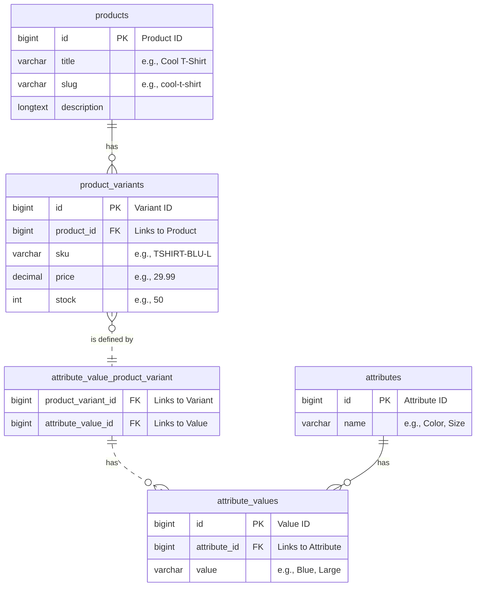

```mermaid
erDiagram
    products {
        bigint id PK "Product ID"
        varchar title "e.g., Cool T-Shirt"
        varchar slug "e.g., cool-t-shirt"
        longtext description
    }

    product_variants {
        bigint id PK "Variant ID"
        bigint product_id FK "Links to Product"
        varchar sku "e.g., TSHIRT-BLU-L"
        decimal price "e.g., 29.99"
        int stock "e.g., 50"
    }

    attributes {
        bigint id PK "Attribute ID"
        varchar name "e.g., Color, Size"
    }

    attribute_values {
        bigint id PK "Value ID"
        bigint attribute_id FK "Links to Attribute"
        varchar value "e.g., Blue, Large"
    }

    attribute_value_product_variant {
        bigint product_variant_id FK "Links to Variant"
        bigint attribute_value_id FK "Links to Value"
    }

    products ||--o{ product_variants : "has"
    product_variants }o..|| attribute_value_product_variant : "is defined by"
    attribute_value_product_variant ||..o{ attribute_values : "has"
    attributes ||--o{ attribute_values : "has"
```